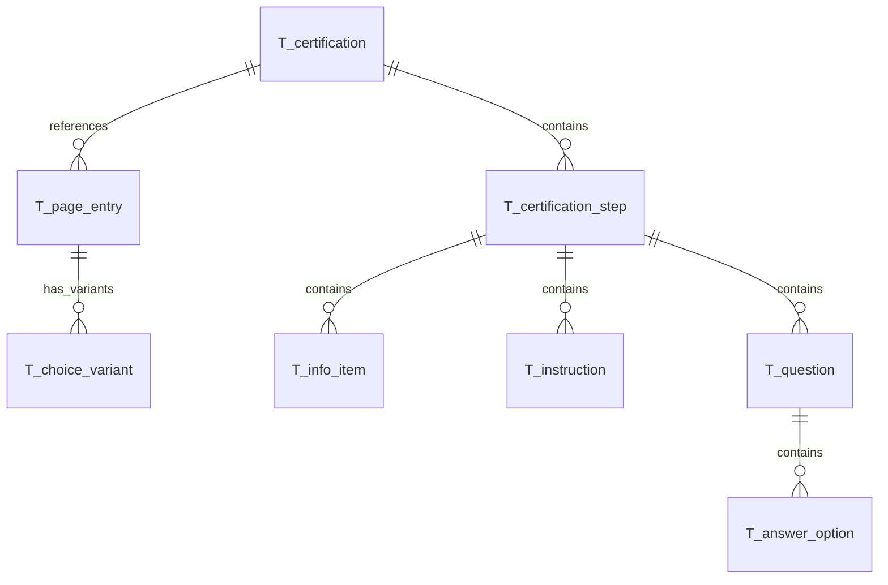

# Database Model Documentation

## Overview

This document describes the database schema for the Abstracertification platform. The schema supports two main concerns:

1. **Certification Definitions** - The structure of hands-on learning certifications (steps, instructions, questions)
2. **User Identity & Authentication** - OAuth2/OIDC identity provider functionality (accounts, credentials, sessions)

This document describes the **certification definition** tables that store hands-on learning content.

The schema is compatible with both MySQL and H2 databases and follows a naming convention where all tables are prefixed with `T_`, foreign keys with `FK_`, and indices with `I_`.

## Entity Relationship Diagram



## Table Descriptions

### T_certification

The `T_certification` table stores the root definition of each certification program.

**Important:** This table contains only the metadata for certifications. The actual step content is stored in `T_certification_step` and related tables.

**Key Features:**
- Certifications are self-contained learning paths with a unique identifier
- The `id` field is a human-readable string (e.g., "linux-home-server") rather than a generated UUID
- Content is versioned implicitly through the `updated_at` timestamp

**Constraints:**
- `PK_certification`: Primary key on `id`
- `I_certification_title`: Unique index on `title`

**Indices:**
- `I_certification_title`: Enforces unique certification titles
- `I_certification_updated`: Index on `updated_at` for cache invalidation queries

**Relationships:**
- One-to-many with `T_page_entry` (certification_id)
- One-to-many with `T_certification_step` (certification_id)

---

### T_page_entry

The `T_page_entry` table defines the navigation flow through a certification. Each entry represents either a direct step reference or a choice point where users select between variants.

**Key Features:**
- `entry_type` distinguishes between DIRECT references and CHOICE points
- `sequence_order` determines the flow order within the certification
- For CHOICE entries, `min_required` and `max_required` control selection constraints

**Constraints:**
- `PK_page_entry`: Primary key on `id`
- `FK_page_entry_certification`: Foreign key to `T_certification`
- `I_page_entry_cert_seq`: Unique composite index on `(certification_id, sequence_order)`

**Status Values:**
- `entry_type`: `DIRECT` - References a step directly; `CHOICE` - User selects from variants

**Indices:**
- `I_page_entry_cert_seq`: Ensures unique ordering within each certification
- `I_page_entry_step`: Index on `direct_step_id` for direct lookups

**Relationships:**
- Many-to-one with `T_certification` via `certification_id`
- Many-to-one with `T_certification_step` via `direct_step_id` (when entry_type = DIRECT)
- One-to-many with `T_choice_variant` via `page_entry_id` (when entry_type = CHOICE)

---

### T_choice_variant

The `T_choice_variant` table defines selectable options within a choice-type page entry. Variants allow certifications to adapt to different user situations (e.g., choosing between Windows or Linux starting points).

**Key Features:**
- Each variant points to a specific step via `step_id`
- The same step can be referenced from multiple choice variants
- Variants are ordered by `sequence_order` for consistent presentation

**Constraints:**
- `PK_choice_variant`: Primary key on `id`
- `FK_choice_variant_page_entry`: Foreign key to `T_page_entry`
- `FK_choice_variant_step`: Foreign key to `T_certification_step`

**Indices:**
- `I_choice_variant_page_seq`: Composite index on `(page_entry_id, sequence_order)`

**Relationships:**
- Many-to-one with `T_page_entry` via `page_entry_id`
- Many-to-one with `T_certification_step` via `step_id`

---

### T_certification_step

The `T_certification_step` table stores individual learning steps — units of instruction with optional assessment questions. Each step belongs exclusively to one certification.

**Key Features:**
- Steps are exclusively owned by a single certification via `certification_id`
- The `why` field provides educational context before instructions
- `info_expanded` controls default visibility of the info section

**Constraints:**
- `PK_certification_step`: Primary key on `id`
- `FK_step_certification`: Foreign key to `T_certification`
- `I_step_cert_key`: Unique composite index on `(certification_id, step_key)`

**Indices:**
- `I_step_cert_key`: Ensures unique step keys within a certification
- `I_step_updated`: Index on `updated_at` for change tracking

**Relationships:**
- Many-to-one with `T_certification` via `certification_id`
- One-to-many with `T_info_item` via `step_id`
- One-to-many with `T_instruction` via `step_id`
- One-to-many with `T_question` via `step_id`

---

### T_info_item

The `T_info_item` table stores key term definitions within a step. These appear in an expandable "Key Concepts" section.

**Key Features:**
- Each item defines a single term and its explanation
- Descriptions can contain Mermaid diagrams for visual concepts
- Items are ordered by `sequence_order` for consistent display

**Constraints:**
- `PK_info_item`: Primary key on `id`
- `FK_info_item_step`: Foreign key to `T_certification_step`

**Indices:**
- `I_info_item_step_seq`: Composite index on `(step_id, sequence_order)`

**Relationships:**
- Many-to-one with `T_certification_step` via `step_id`

---

### T_instruction

The `T_instruction` table stores the sequential instructions that guide users through completing a step.

**Key Features:**
- Instructions are ordered by `sequence_order` — users follow them sequentially
- `command` contains example commands (not executable, for reference only)
- `note` provides warnings, tips, or important caveats
- `mermaid_diagram` can contain network diagrams or process flows

**Constraints:**
- `PK_instruction`: Primary key on `id`
- `FK_instruction_step`: Foreign key to `T_certification_step`

**Indices:**
- `I_instruction_step_seq`: Composite index on `(step_id, sequence_order)`

**Relationships:**
- Many-to-one with `T_certification_step` via `step_id`

---

### T_question

The `T_question` table stores assessment questions at the end of each step to verify user understanding.

**Key Features:**
- Questions are multiple-choice with exactly one correct answer
- `question_key` provides a stable identifier (e.g., "q-ssh-1") within the step
- Questions are optional — some steps may have no questions (empty questions array)

**Constraints:**
- `PK_question`: Primary key on `id`
- `FK_question_step`: Foreign key to `T_certification_step`
- `I_question_step_key`: Unique composite index on `(step_id, question_key)`

**Indices:**
- `I_question_step_key`: Ensures unique question keys within a step
- `I_question_step_seq`: Index on `(step_id, sequence_order)` for ordered retrieval

**Relationships:**
- Many-to-one with `T_certification_step` via `step_id`
- One-to-many with `T_answer_option` via `question_id`

---

### T_answer_option

The `T_answer_option` table stores the answer options for multiple-choice questions.

**Key Features:**
- Exactly one option per question has `is_correct = true`
- Distractor options test common misconceptions
- Typically 4 options per question, but the schema supports any number

**Constraints:**
- `PK_answer_option`: Primary key on `id`
- `FK_answer_option_question`: Foreign key to `T_question`

**Indices:**
- `I_answer_option_question_seq`: Composite index on `(question_id, sequence_order)`

**Relationships:**
- Many-to-one with `T_question` via `question_id`

## Naming Conventions

The database follows strict naming conventions for consistency and clarity:

- **Tables**: Prefixed with `T_` (e.g., `T_accounts`, `T_oauth_clients`)
- **Foreign Keys**: Format `FK_<tableName>_<columnName>` (e.g., `FK_credentials_account_id`)
- **Indices**: Format `I_<tableName>_<columnName(s)>` (e.g., `I_accounts_email`)
- **Primary Keys**: Always named `id` using VARCHAR(36) for UUID storage
- **Timestamps**: Use `created_at` and `expires_at` naming pattern

## Data Flow

### Certification Definition Flow

1. **Content Creation:** Administrators define certifications directly in the database via admin APIs
2. **Storage:** Certification definitions are stored in normalized relational tables
3. **API Serving:** REST endpoints serve certification definitions to the Angular frontend
4. **User Navigation:** Users progress through `page_entries`, choosing variants at choice points
5. **Content Rendering:** The UI displays step content with info items, instructions, and questions

### Key Query Patterns

- **Load Certification:** Join `T_certification` → `T_page_entry` → `T_choice_variant` → `T_certification_step`
- **Load Step Content:** Join `T_certification_step` → `T_info_item` + `T_instruction` + `T_question` → `T_answer_option`
- **List All Certifications:** Simple select from `T_certification` ordered by title

## Database Compatibility

The schema is designed to work with both MySQL and H2 databases:

- Uses standard SQL data types
- Avoids database-specific features
- Named constraints for explicit control
- Separate CREATE INDEX statements for compatibility
- BOOLEAN type supported by both databases
- VARCHAR lengths within common limits

## Indexes and Performance

Strategic indexes are placed for common query patterns:

- **Unique Indexes**: Enforce business rules (email, username, client_id, code)
- **Composite Indexes**: Support multi-column queries (client_id + account_id)
- **Expiration Indexes**: Enable efficient cleanup of expired records
- **Foreign Key Indexes**: Implicit indexes on FK columns for join performance

## Security Considerations

- **Password Storage**: Only hashed passwords stored, never plaintext
- **Expiration**: All temporary entities have expiration timestamps
- **Cascade Deletes**: Automatic cleanup of related records
- **One-Time Codes**: Authorization codes can only be used once

## Maintenance

### Content Management Queries

```sql
-- List all certifications with step counts
SELECT 
    c.id,
    c.title,
    COUNT(DISTINCT cs.id) AS step_count,
    COUNT(DISTINCT q.id) AS question_count
FROM T_certification c
LEFT JOIN T_certification_step cs ON c.id = cs.certification_id
LEFT JOIN T_question q ON cs.id = q.step_id
GROUP BY c.id, c.title
ORDER BY c.title;

-- Find steps with missing questions (potential content gaps)
SELECT cs.step_key, cs.title, cs.certification_id
FROM T_certification_step cs
LEFT JOIN T_question q ON cs.id = q.step_id
WHERE q.id IS NULL;

-- List instructions that contain commands (for command reference audit)
SELECT cs.step_key, i.sequence_order, i.command
FROM T_instruction i
JOIN T_certification_step cs ON i.step_id = cs.id
WHERE i.command IS NOT NULL AND i.command != ''
ORDER BY cs.certification_id, cs.step_key, i.sequence_order;
```

### Integrity Verification

```sql
-- Check for orphaned choice variants (missing page entry)
SELECT cv.*
FROM T_choice_variant cv
LEFT JOIN T_page_entry pe ON cv.page_entry_id = pe.id
WHERE pe.id IS NULL;

-- Check for orphaned questions (missing step)
SELECT q.*
FROM T_question q
LEFT JOIN T_certification_step cs ON q.step_id = cs.id
WHERE cs.id IS NULL;

-- Verify each question has exactly one correct answer
SELECT 
    q.id AS question_id,
    q.question_key,
    COUNT(CASE WHEN ao.is_correct THEN 1 END) AS correct_count
FROM T_question q
LEFT JOIN T_answer_option ao ON q.id = ao.question_id
GROUP BY q.id, q.question_key
HAVING COUNT(CASE WHEN ao.is_correct THEN 1 END) != 1;
```

