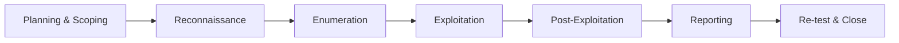

# Introduction to Security Testing — Certification Outline

**Proposed ID:** `intro-security-testing`  
**Proposed title:** Introduction to Security Testing  
**Proposed description:** Security testing is not just running a scanner and hoping for the best. It is a discipline with a rich body of knowledge, professional standards, legal obligations, and human responsibilities. This certification introduces you to all dimensions of security testing — what it is, who does it, how it is governed, and why it matters — without assuming any technical background.

---

## Overview

This certification is **non-technical** and is aimed at:

- Developers who want to understand the broader context of security testing
- Managers, product owners, and business stakeholders who commission or oversee security work
- Anyone considering a move into a security testing role

It uses a **page-per-topic** approach, each page standing on its own. There are no labs or commands to run.

---

## Proposed Pages (Steps)

### 1. Introduction — What Is Security Testing?

Sets the stage: what security testing is, why it exists, and how it differs from functional testing. Introduces the core goal — finding weaknesses before attackers do — and the idea that security testing is a *continuous* discipline, not a one-off activity.

**Key concepts:** vulnerability, threat, risk, attack surface, security vs. functional testing

---

### 2. The Security Testing Landscape

Maps out the major categories of security testing so candidates understand the full terrain: penetration testing, vulnerability scanning, threat modelling, code review, social engineering, red teaming, bug bounties, and compliance auditing. Explains how these relate to one another and when each is appropriate.

**Key concepts:** penetration testing, vulnerability scanning, red team / blue team / purple team, threat modelling, bug bounty programme, security audit

---

### 3. Ethics and Professional Conduct

Explores why ethics is the foundation of security work. Covers the hacker ethic, responsible disclosure, the difference between ethical hacking and malicious hacking, and what it means to behave professionally when you have access to sensitive systems. Introduces the concept of "do no harm."

**Key concepts:** ethical hacking, responsible disclosure, coordinated vulnerability disclosure (CVD), bug bounty ethics, "do no harm," professionalism

---

### 4. Legal Frameworks and Authorisation

Security testing without authorisation is a crime in most jurisdictions. This page explains the legal landscape: key laws (Computer Misuse Act, CFAA, GDPR, etc.), what constitutes authorisation, what happens when testers go out of scope, and how to protect yourself as a practitioner.

**Key concepts:** authorisation, scope, Computer Misuse Act, Computer Fraud and Abuse Act (CFAA), GDPR, written permission, out-of-scope

---

### 5. Roles and Responsibilities

Who does security testing, and what does each role own? Covers the range of roles: security tester, penetration tester, security engineer, CISO, security champion, DevSecOps engineer, compliance officer. Also covers client and vendor responsibilities: what the organisation commissioning the test must provide, and what the testing team must guarantee.

**Key concepts:** penetration tester, CISO, security champion, DevSecOps, client vs. vendor responsibilities, rules of engagement

---

### 6. Organisational Security Programmes

Security testing does not live in isolation — it is part of a wider organisational security programme. This page introduces security policies, risk registers, security by design, the SDL (Secure Development Lifecycle), and how security testing fits into each stage of software delivery.

**Key concepts:** security policy, risk register, Secure Development Lifecycle (SDL), security by design, shift-left, security gates

---

### 7. Standards, Frameworks, and Certifications

The security testing industry is guided by frameworks and standards. This page introduces the most important ones: OWASP, PTES, OSSTMM, NIST SP 800-115, ISO 27001, and professional certifications such as OSCP, CEH, and CREST. Explains what each is for and who uses it.

**Key concepts:** OWASP, PTES (Penetration Testing Execution Standard), OSSTMM, NIST SP 800-115, ISO 27001, OSCP, CEH, CREST

---

### 8. Scoping and Rules of Engagement

Before any test begins, scope must be agreed. This page covers how to define what is in and out of scope, how to write rules of engagement, what emergency stop procedures look like, and how to handle accidental discoveries (e.g., finding a breach that is already in progress).

**Key concepts:** scope, rules of engagement, statement of work, emergency stop procedure, accidental discovery, third-party systems

---

### 9. The Testing Lifecycle

A structured walkthrough of the stages all security engagements go through: reconnaissance, enumeration, exploitation, post-exploitation, and reporting. This page is non-technical — it focuses on *what happens* and *why* at each stage, not *how* to do it technically.

**Key concepts:** reconnaissance, enumeration, exploitation, post-exploitation, clean-up, reporting, re-testing

---

### 10. Reporting and Communication

The test report is the primary deliverable. This page covers what a good security report contains, how findings are graded (CVSS, risk ratings), how to communicate findings to technical and non-technical audiences, and the difference between an executive summary and a technical annex. Covers safe handling and distribution of the report.

**Key concepts:** CVSS, risk rating (Critical / High / Medium / Low / Informational), executive summary, technical annex, finding, remediation recommendation, safe distribution

---

### 11. Working with Sensitive Information

During a test, testers encounter credentials, personal data, intellectual property, and other highly sensitive material. This page covers the obligations around data handling: data minimisation, secure storage, what to do if you encounter PII, and how to ensure all data is securely destroyed at the end of the engagement.

**Key concepts:** data minimisation, PII, data handling obligations, secure deletion, chain of custody, confidentiality agreement (NDA)

---

### 12. Vulnerability Management and Remediation

Finding vulnerabilities is only half the job. This page covers how organisations track and remediate findings: vulnerability management lifecycles, CVSS scoring, SLA/SLO for remediation, risk acceptance, the concept of residual risk, and the role of re-testing to confirm fixes.

**Key concepts:** vulnerability management, CVSS, SLA/SLO, risk acceptance, residual risk, remediation, re-test

---

### 13. Security Testing in Agile and DevSecOps Environments

Modern software teams work in sprints. This page explains how security testing integrates into agile delivery: security user stories, threat modelling in sprint planning, automated security scanning in CI/CD, and the security champion model. Covers SAST, DAST, and SCA at a conceptual level.

**Key concepts:** DevSecOps, SAST, DAST, SCA, security user story, security in CI/CD, security champion, threat modelling in agile

---

### 14. Cloud and Third-Party Considerations

Cloud providers, SaaS vendors, and third-party APIs introduce testing complications. This page covers shared responsibility models, what cloud providers permit testers to do, the challenges of testing microservices, and how to handle third-party dependencies and supply chain security concerns.

**Key concepts:** shared responsibility model, cloud penetration testing rules, microservices, supply chain security, third-party risk

---

### 15. Social Engineering and the Human Element

Technology is only part of the attack surface. This page introduces social engineering — phishing, vishing, pretexting, physical intrusion — and explains why human behaviour is often the weakest link. Covers the ethics of social engineering tests, consent requirements, and how organisations build a security-aware culture.

**Key concepts:** social engineering, phishing, vishing, pretexting, physical security testing, security awareness training, human factor

---

### 16. Continuous Security and the Path Forward

Closes the certification. Ties all the threads together: security testing is continuous, evolving, and human. Introduces the idea of a security testing maturity model, how organisations measure and improve their security posture over time, and what a career in security testing looks like.

**Key concepts:** security maturity model, continuous improvement, security posture, threat intelligence, career paths (penetration tester, security engineer, CISO, auditor)

---

## Summary

| # | Page Title | Primary Theme |
|---|-----------|---------------|
| 1 | What Is Security Testing? | Foundations |
| 2 | The Security Testing Landscape | Taxonomy |
| 3 | Ethics and Professional Conduct | Ethics |
| 4 | Legal Frameworks and Authorisation | Law |
| 5 | Roles and Responsibilities | People |
| 6 | Organisational Security Programmes | Organisation |
| 7 | Standards, Frameworks, and Certifications | Industry standards |
| 8 | Scoping and Rules of Engagement | Process |
| 9 | The Testing Lifecycle | Process |
| 10 | Reporting and Communication | Deliverables |
| 11 | Working with Sensitive Information | Data handling |
| 12 | Vulnerability Management and Remediation | Post-test |
| 13 | Security Testing in Agile / DevSecOps | Modern delivery |
| 14 | Cloud and Third-Party Considerations | Modern environments |
| 15 | Social Engineering and the Human Element | Human factor |
| 16 | Continuous Security and the Path Forward | Career / maturity |

---

*Review this outline and confirm before the SQL migration is written.*
