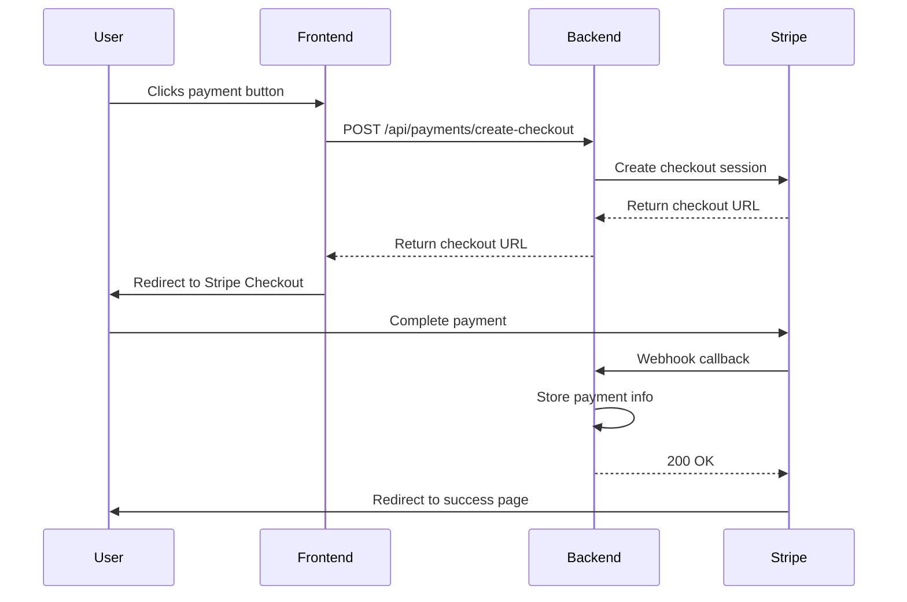

# Stripe Integration Guide

This document describes how to integrate Stripe payment processing into the Abstracertification application using Quarkus.

## Overview

The integration provides:
- Payment links for users to complete purchases
- Webhook callbacks to notify the application of payment completion
- Metadata handling for invoice numbers and payment identification
- Secure payment processing with Stripe Checkout

## Prerequisites

- Stripe account (test and production)
- Stripe API keys (publishable and secret)
- Webhook endpoint configured in Stripe dashboard
- Quarkus application with REST endpoints

## Configuration

### Application Properties

Add the following to `src/main/resources/application.properties`:

```properties
# Stripe Configuration
stripe.api.key=${STRIPE_API_KEY}
stripe.publishable.key=${STRIPE_PUBLISHABLE_KEY}
stripe.webhook.secret=${STRIPE_WEBHOOK_SECRET}

# Webhook endpoint URL (configured in Stripe dashboard)
stripe.webhook.endpoint=/api/payments/webhook
```

### Environment Variables

Set these environment variables:
- `STRIPE_API_KEY`: Your Stripe secret API key
- `STRIPE_PUBLISHABLE_KEY`: Your Stripe publishable key
- `STRIPE_WEBHOOK_SECRET`: Webhook signing secret from Stripe dashboard

## Dependencies

Add to your `pom.xml`:

```xml
<dependency>
    <groupId>com.stripe</groupId>
    <artifactId>stripe-java</artifactId>
    <version>24.16.0</version>
</dependency>
```

## Backend Implementation

### Stripe Service

Create `src/main/java/dev/abstratium/certification/service/StripeService.java`:

```java
package dev.abstratium.certification.service;

import com.stripe.Stripe;
import com.stripe.exception.StripeException;
import com.stripe.model.checkout.Session;
import com.stripe.param.checkout.SessionCreateParams;
import jakarta.enterprise.context.ApplicationScoped;
import jakarta.inject.Inject;
import org.eclipse.microprofile.config.inject.ConfigProperty;

import java.math.BigDecimal;
import java.util.HashMap;
import java.util.Map;

@ApplicationScoped
public class StripeService {
    
    @ConfigProperty(name = "stripe.api.key")
    String stripeApiKey;
    
    @ConfigProperty(name = "stripe.publishable.key")
    String publishableKey;
    
    @Inject
    PaymentService paymentService;
    
    public String getPublishableKey() {
        return publishableKey;
    }
    
    public String createPaymentCheckoutSession(BigDecimal amount, String currency, 
                                              String invoiceNumber, String description) 
            throws StripeException {
        
        Stripe.apiKey = stripeApiKey;
        
        Map<String, String> metadata = new HashMap<>();
        metadata.put("invoice_number", invoiceNumber);
        metadata.put("application", "abstracertification");
        
        SessionCreateParams params = SessionCreateParams.builder()
                .setMode(SessionCreateParams.Mode.PAYMENT)
                .setSuccessUrl("https://yourapp.com/payment/success?session_id={CHECKOUT_SESSION_ID}")
                .setCancelUrl("https://yourapp.com/payment/cancel")
                .addLineItem(SessionCreateParams.LineItem.builder()
                        .setPriceData(SessionCreateParams.LineItem.PriceData.builder()
                                .setCurrency(currency.toLowerCase())
                                .setUnitAmount(amount.multiply(new BigDecimal("100")).longValue())
                                .setProductData(SessionCreateParams.LineItem.PriceData.ProductData.builder()
                                        .setName(description)
                                        .build())
                                .build())
                        .setQuantity(1L)
                        .build())
                .setMetadata(metadata)
                .build();
        
        Session session = Session.create(params);
        return session.getUrl();
    }
}
```

### Payment Webhook Controller

Create `src/main/java/dev/abstratium/certification/controller/PaymentWebhookController.java`:

```java
package dev.abstratium.certification.controller;

import com.stripe.Stripe;
import com.stripe.exception.SignatureVerificationException;
import com.stripe.model.Event;
import com.stripe.model.checkout.Session;
import com.stripe.net.Webhook;
import jakarta.enterprise.context.ApplicationScoped;
import jakarta.inject.Inject;
import jakarta.ws.rs.Consumes;
import jakarta.ws.rs.POST;
import jakarta.ws.rs.Path;
import jakarta.ws.rs.core.Response;
import org.eclipse.microprofile.config.inject.ConfigProperty;
import org.slf4j.Logger;
import org.slf4j.LoggerFactory;

import dev.abstratium.certification.service.PaymentService;

@ApplicationScoped
@Path("/api/payments")
public class PaymentWebhookController {
    
    private static final Logger logger = LoggerFactory.getLogger(PaymentWebhookController.class);
    
    @ConfigProperty(name = "stripe.api.key")
    String stripeApiKey;
    
    @ConfigProperty(name = "stripe.webhook.secret")
    String webhookSecret;
    
    @Inject
    PaymentService paymentService;
    
    @POST
    @Path("/webhook")
    @Consumes("application/json")
    public Response handleWebhook(String payload, String stripeSignature) {
        try {
            Stripe.apiKey = stripeApiKey;
            
            Event event = Webhook.constructEvent(payload, stripeSignature, webhookSecret);
            
            switch (event.getType()) {
                case "checkout.session.completed":
                    Session session = (Session) event.getDataObjectDeserializer().getObject().get();
                    handleCompletedCheckout(session);
                    break;
                    
                case "payment_intent.succeeded":
                    // Handle payment intent success if needed
                    break;
                    
                default:
                    logger.info("Unhandled event type: {}", event.getType());
            }
            
            return Response.ok().build();
            
        } catch (SignatureVerificationException e) {
            logger.error("Invalid signature", e);
            return Response.status(Response.Status.BAD_REQUEST).build();
        } catch (Exception e) {
            logger.error("Webhook processing failed", e);
            return Response.status(Response.Status.INTERNAL_SERVER_ERROR).build();
        }
    }
    
    private void handleCompletedCheckout(Session session) {
        try {
            String invoiceNumber = session.getMetadata().get("invoice_number");
            String stripePaymentId = session.getPaymentIntent();
            String customerEmail = session.getCustomerDetails().getEmail();
            Long amount = session.getAmountTotal();
            String currency = session.getCurrency();
            
            paymentService.recordPayment(
                invoiceNumber,
                stripePaymentId,
                customerEmail,
                amount,
                currency,
                "COMPLETED"
            );
            
            logger.info("Payment recorded for invoice: {}", invoiceNumber);
            
        } catch (Exception e) {
            logger.error("Failed to process completed checkout", e);
        }
    }
}
```

### Payment Controller

Create `src/main/java/dev/abstratium/certification/controller/PaymentController.java`:

```java
package dev.abstratium.certification.controller;

import dev.abstratium.certification.service.StripeService;
import jakarta.inject.Inject;
import jakarta.ws.rs.*;
import jakarta.ws.rs.core.MediaType;
import jakarta.ws.rs.core.Response;

import java.math.BigDecimal;

@Path("/api/payments")
@Produces(MediaType.APPLICATION_JSON)
@Consumes(MediaType.APPLICATION_JSON)
public class PaymentController {
    
    @Inject
    StripeService stripeService;
    
    @POST
    @Path("/create-checkout")
    public Response createCheckoutSession(PaymentRequest request) {
        try {
            String checkoutUrl = stripeService.createPaymentCheckoutSession(
                request.getAmount(),
                request.getCurrency(),
                request.getInvoiceNumber(),
                request.getDescription()
            );
            
            return Response.ok(new CheckoutResponse(checkoutUrl)).build();
            
        } catch (Exception e) {
            return Response.status(Response.Status.INTERNAL_SERVER_ERROR)
                    .entity(new ErrorResponse("Failed to create checkout session"))
                    .build();
        }
    }
    
    @GET
    @Path("/config")
    public Response getStripeConfig() {
        return Response.ok(new StripeConfigResponse(stripeService.getPublishableKey()))
                .build();
    }
    
    // DTO classes
    public static class PaymentRequest {
        private BigDecimal amount;
        private String currency;
        private String invoiceNumber;
        private String description;
        
        // Getters and setters
        public BigDecimal getAmount() { return amount; }
        public void setAmount(BigDecimal amount) { this.amount = amount; }
        public String getCurrency() { return currency; }
        public void setCurrency(String currency) { this.currency = currency; }
        public String getInvoiceNumber() { return invoiceNumber; }
        public void setInvoiceNumber(String invoiceNumber) { this.invoiceNumber = invoiceNumber; }
        public String getDescription() { return description; }
        public void setDescription(String description) { this.description = description; }
    }
    
    public static class CheckoutResponse {
        private String checkoutUrl;
        public CheckoutResponse(String checkoutUrl) { this.checkoutUrl = checkoutUrl; }
        public String getCheckoutUrl() { return checkoutUrl; }
    }
    
    public static class StripeConfigResponse {
        private String publishableKey;
        public StripeConfigResponse(String publishableKey) { this.publishableKey = publishableKey; }
        public String getPublishableKey() { return publishableKey; }
    }
    
    public static class ErrorResponse {
        private String error;
        public ErrorResponse(String error) { this.error = error; }
        public String getError() { return error; }
    }
}
```

### Payment Service

Create or update `src/main/java/dev/abstratium/certification/service/PaymentService.java`:

```java
package dev.abstratium.certification.service;

import dev.abstratium.certification.model.Payment;
import jakarta.enterprise.context.ApplicationScoped;
import jakarta.persistence.EntityManager;
import jakarta.persistence.PersistenceContext;
import jakarta.transaction.Transactional;

import java.time.LocalDateTime;

@ApplicationScoped
public class PaymentService {
    
    @PersistenceContext
    EntityManager entityManager;
    
    @Transactional
    public void recordPayment(String invoiceNumber, String stripePaymentId, 
                             String customerEmail, Long amount, String currency, 
                             String status) {
        
        Payment payment = new Payment();
        payment.setInvoiceNumber(invoiceNumber);
        payment.setStripePaymentId(stripePaymentId);
        payment.setCustomerEmail(customerEmail);
        payment.setAmount(amount);
        payment.setCurrency(currency);
        payment.setStatus(status);
        payment.setPaymentDate(LocalDateTime.now());
        
        entityManager.persist(payment);
    }
}
```

### Payment Entity

Create `src/main/java/dev/abstratium/certification/model/Payment.java`:

```java
package dev.abstratium.certification.model;

import jakarta.persistence.*;
import java.time.LocalDateTime;

@Entity
@Table(name = "payments")
public class Payment {
    
    @Id
    @GeneratedValue(strategy = GenerationType.IDENTITY)
    private Long id;
    
    @Column(unique = true, nullable = false)
    private String invoiceNumber;
    
    @Column(name = "stripe_payment_id")
    private String stripePaymentId;
    
    @Column(name = "customer_email")
    private String customerEmail;
    
    @Column(nullable = false)
    private Long amount;
    
    @Column(nullable = false)
    private String currency;
    
    @Column(nullable = false)
    private String status;
    
    @Column(name = "payment_date")
    private LocalDateTime paymentDate;
    
    // Getters and setters
    public Long getId() { return id; }
    public void setId(Long id) { this.id = id; }
    public String getInvoiceNumber() { return invoiceNumber; }
    public void setInvoiceNumber(String invoiceNumber) { this.invoiceNumber = invoiceNumber; }
    public String getStripePaymentId() { return stripePaymentId; }
    public void setStripePaymentId(String stripePaymentId) { this.stripePaymentId = stripePaymentId; }
    public String getCustomerEmail() { return customerEmail; }
    public void setCustomerEmail(String customerEmail) { this.customerEmail = customerEmail; }
    public Long getAmount() { return amount; }
    public void setAmount(Long amount) { this.amount = amount; }
    public String getCurrency() { return currency; }
    public void setCurrency(String currency) { this.currency = currency; }
    public String getStatus() { return status; }
    public void setStatus(String status) { this.status = status; }
    public LocalDateTime getPaymentDate() { return paymentDate; }
    public void setPaymentDate(LocalDateTime paymentDate) { this.paymentDate = paymentDate; }
}
```

## Frontend Implementation

### Angular Payment Service

Create `src/main/webui/src/app/core/services/payment.service.ts`:

```typescript
import { Injectable } from '@angular/core';
import { HttpClient } from '@angular/common/http';
import { Observable } from 'rxjs';

export interface PaymentRequest {
  amount: number;
  currency: string;
  invoiceNumber: string;
  description: string;
}

export interface CheckoutResponse {
  checkoutUrl: string;
}

export interface StripeConfig {
  publishableKey: string;
}

@Injectable({
  providedIn: 'root'
})
export class PaymentService {
  private readonly apiUrl = '/api/payments';

  constructor(private http: HttpClient) {}

  createCheckoutSession(request: PaymentRequest): Observable<CheckoutResponse> {
    return this.http.post<CheckoutResponse>(`${this.apiUrl}/create-checkout`, request);
  }

  getStripeConfig(): Observable<StripeConfig> {
    return this.http.get<StripeConfig>(`${this.apiUrl}/config`);
  }

  redirectToCheckout(checkoutUrl: string): void {
    window.location.href = checkoutUrl;
  }
}
```

### Payment Component

Create `src/main/webui/src/app/core/payment/payment.component.ts`:

```typescript
import { Component, OnInit } from '@angular/core';
import { PaymentService, PaymentRequest } from '../services/payment.service';

@Component({
  selector: 'app-payment',
  template: `
    <div class="payment-container">
      <h2>Complete Payment</h2>
      <div class="payment-details">
        <p><strong>Invoice:</strong> {{ invoiceNumber }}</p>
        <p><strong>Amount:</strong> {{ amount | currency:currency }}</p>
        <p><strong>Description:</strong> {{ description }}</p>
      </div>
      <button (click)="proceedToPayment()" 
              [disabled]="isLoading"
              class="btn btn-primary">
        <span *ngIf="isLoading">Processing...</span>
        <span *ngIf="!isLoading">Pay with Stripe</span>
      </button>
    </div>
  `,
  styles: [`
    .payment-container {
      max-width: 500px;
      margin: 50px auto;
      padding: 20px;
      border: 1px solid #ddd;
      border-radius: 8px;
    }
    .payment-details {
      margin: 20px 0;
    }
    .btn {
      padding: 12px 24px;
      border: none;
      border-radius: 4px;
      cursor: pointer;
      font-size: 16px;
    }
    .btn-primary {
      background-color: #007bff;
      color: white;
    }
    .btn:disabled {
      opacity: 0.6;
      cursor: not-allowed;
    }
  `]
})
export class PaymentComponent implements OnInit {
  invoiceNumber: string = '';
  amount: number = 0;
  currency: string = 'USD';
  description: string = '';
  isLoading: boolean = false;

  constructor(private paymentService: PaymentService) {}

  ngOnInit(): void {
    // Get payment details from route params or service
    this.initializePaymentDetails();
  }

  private initializePaymentDetails(): void {
    // Example: Get from route parameters
    // this.route.params.subscribe(params => {
    //   this.invoiceNumber = params['invoiceNumber'];
    //   this.amount = params['amount'];
    //   this.description = params['description'];
    // });
  }

  proceedToPayment(): void {
    this.isLoading = true;
    
    const request: PaymentRequest = {
      amount: this.amount,
      currency: this.currency,
      invoiceNumber: this.invoiceNumber,
      description: this.description
    };

    this.paymentService.createCheckoutSession(request)
      .subscribe({
        next: (response) => {
          this.paymentService.redirectToCheckout(response.checkoutUrl);
        },
        error: (error) => {
          console.error('Payment failed:', error);
          this.isLoading = false;
          // Handle error (show message to user)
        }
      });
  }
}
```

## Database Migration

Create a Flyway migration for the payments table:

`src/main/resources/db/migration/V2__Create_payments_table.sql`:

```sql
CREATE TABLE payments (
    id BIGINT AUTO_INCREMENT PRIMARY KEY,
    invoice_number VARCHAR(255) NOT NULL UNIQUE,
    stripe_payment_id VARCHAR(255),
    customer_email VARCHAR(255),
    amount BIGINT NOT NULL,
    currency VARCHAR(3) NOT NULL,
    status VARCHAR(50) NOT NULL,
    payment_date TIMESTAMP NOT NULL,
    created_at TIMESTAMP DEFAULT CURRENT_TIMESTAMP,
    updated_at TIMESTAMP DEFAULT CURRENT_TIMESTAMP ON UPDATE CURRENT_TIMESTAMP
);

CREATE INDEX idx_payments_invoice_number ON payments(invoice_number);
CREATE INDEX idx_payments_stripe_payment_id ON payments(stripe_payment_id);
CREATE INDEX idx_payments_status ON payments(status);
```

## Testing

### Unit Tests

Create `src/test/java/dev/abstratium/certification/service/StripeServiceTest.java`:

```java
package dev.abstratium.certification.service;

import com.stripe.exception.StripeException;
import io.quarkus.test.junit.QuarkusTest;
import jakarta.inject.Inject;
import org.junit.jupiter.api.Test;

import java.math.BigDecimal;

import static org.junit.jupiter.api.Assertions.*;

@QuarkusTest
public class StripeServiceTest {
    
    @Inject
    StripeService stripeService;
    
    @Test
    public void testGetPublishableKey() {
        assertNotNull(stripeService.getPublishableKey());
    }
    
    @Test
    public void testCreateCheckoutSession() throws StripeException {
        // Note: This test requires actual Stripe API key or mocking
        // Consider using Stripe test mode or mocking the API
    }
}
```

### Integration Tests

Create `src/test/java/dev/abstratium/certification/controller/PaymentControllerTest.java`:

```java
package dev.abstratium.certification.controller;

import io.quarkus.test.junit.QuarkusTest;
import org.junit.jupiter.api.Test;

import static io.restassured.RestAssured.given;
import static org.hamcrest.CoreMatchers.notNullValue;

@QuarkusTest
public class PaymentControllerTest {
    
    @Test
    public void testGetStripeConfig() {
        given()
            .when().get("/api/payments/config")
            .then()
                .statusCode(200)
                .body("publishableKey", notNullValue());
    }
}
```

## Security Considerations

1. **API Key Security**: Never expose the secret API key in frontend code
2. **Webhook Verification**: Always verify webhook signatures using the webhook secret
3. **HTTPS**: Ensure all payment-related endpoints use HTTPS
4. **Input Validation**: Validate all payment amounts and invoice numbers
5. **Rate Limiting**: Implement rate limiting on payment endpoints

## Deployment Configuration

### Docker Environment Variables

```dockerfile
ENV STRIPE_API_KEY=sk_test_...
ENV STRIPE_PUBLISHABLE_KEY=pk_test_...
ENV STRIPE_WEBHOOK_SECRET=whsec_...
```

### Kubernetes Secrets

```yaml
apiVersion: v1
kind: Secret
metadata:
  name: stripe-secrets
type: Opaque
data:
  stripe-api-key: <base64-encoded-secret-key>
  stripe-publishable-key: <base64-encoded-publishable-key>
  stripe-webhook-secret: <base64-encoded-webhook-secret>
```

## Webhook Configuration in Stripe Dashboard

1. Go to Stripe Dashboard → Webhooks
2. Add endpoint: `https://yourdomain.com/api/payments/webhook`
3. Select events to listen for:
   - `checkout.session.completed`
   - `payment_intent.succeeded`
4. Copy the webhook signing secret to your configuration

## Error Handling

Common error scenarios and handling:

1. **Payment Failed**: Update payment status to 'FAILED'
2. **Webhook Timeout**: Implement retry logic with exponential backoff
3. **Duplicate Webhooks**: Use idempotency keys or check for existing payments
4. **Network Issues**: Implement proper timeout and retry mechanisms

## Monitoring and Logging

- Log all payment events with correlation IDs
- Monitor webhook processing success/failure rates
- Set up alerts for payment failures
- Track payment completion times

## Flow Diagram



## Next Steps

1. Set up Stripe account and obtain API keys
2. Configure webhook endpoints in Stripe dashboard
3. Implement the backend services and controllers
4. Create the frontend payment components
5. Run database migrations
6. Test with Stripe test mode
7. Deploy to production with live keys

This integration provides a secure, scalable payment processing solution with proper error handling, logging, and monitoring capabilities.
