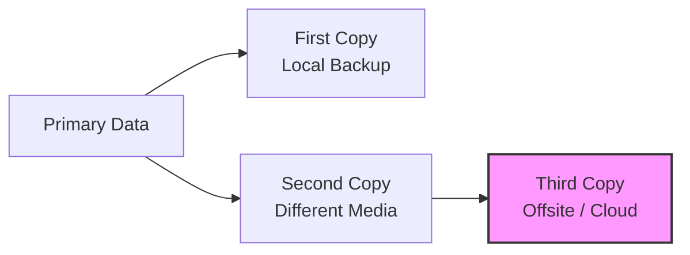
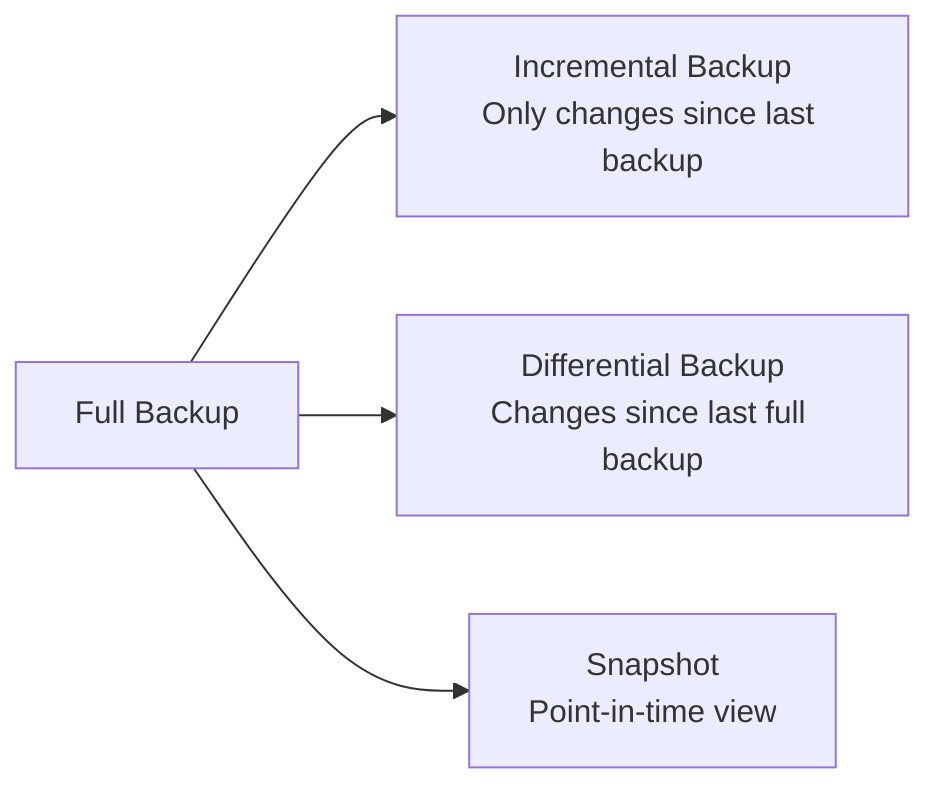
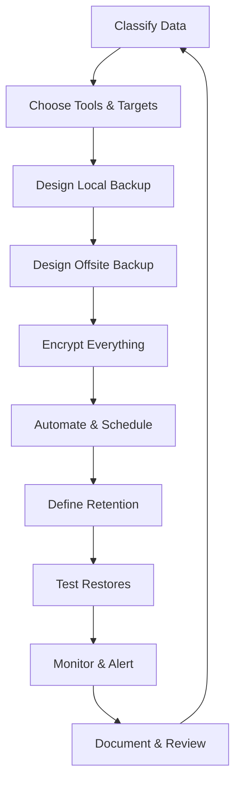

# Professional Backup Process for Linux-Based Small Businesses — Certification Outline

**Proposed ID:** `professional-linux-backup-process`  
**Proposed title:** Professional Backup Process for Linux-Based Small Businesses  
**Proposed description:** Backups are not a luxury — they are the insurance policy that keeps a small business alive when disks fail, ransomware strikes, or a single mistaken command wipes out years of work. This certification teaches a complete, professional backup process designed for small businesses that run Linux servers and workstations. It covers the 3-2-1 backup rule, how to classify documents and data so the right retention policy and strategy are applied, and how to implement, automate, encrypt, and test the entire backup lifecycle using practical Linux tools.

**Important Notes:**
- This certification is designed for **small businesses and technical staff who already use Linux**, not for enterprise IT architects.
- The focus is on **practical, affordable, and recoverable** backup processes rather than vendor-specific products or expensive appliances.
- All command examples are illustrative; actual commands and parameters are defined in the full migration content.

---

## Overview

This certification is aimed at:

- Small business owners and operators who rely on Linux for their infrastructure
- System administrators and IT generalists supporting small business Linux environments
- Freelancers and consultants who need to protect client data on Linux servers
- Developers and engineers running production services on modest Linux setups
- Anyone responsible for keeping business data safe without an enterprise budget

It assumes **no prior backup planning experience**, but basic Linux command-line familiarity. Every concept is introduced from first principles with concrete examples from small business operations.

---

## Proposed Pages (Steps)

### 1. Why Backups Fail — The Moment You Need Them

Sets the stage with a realistic small business scenario: a design studio loses its project server to a failed RAID array and discovers that the "backups" were not running, were incomplete, or could not be restored. Introduces the core truth that backups are only useful if they are planned, tested, and maintained.

**Key concepts:** backup failure modes, data loss stories, recovery time objective (RTO), recovery point objective (RPO), the difference between copying files and having a backup strategy

---

### 2. What You Are Actually Protecting — Assets and Threats

Before choosing tools, a business must know what it needs to protect. This page walks through identifying critical assets: customer databases, accounting files, design work, code repositories, configuration files, email, and website content. It also maps the threats that make backups necessary: hardware failure, human error, ransomware, theft, fire, and software bugs.

**Key concepts:** critical asset inventory, threat categories, data-at-rest vs data-in-motion, business continuity vs backup

---

### 3. The 3-2-1 Backup Rule — The Foundation of Backup Theory

Explains the most widely accepted backup rule: **3 copies of data, on 2 different media, with 1 stored offsite**. Discusses why each number matters, what counts as a different medium, and why offsite protects against site-wide disasters. Includes a discussion of the modern 3-2-1-1 variant that adds one immutable copy.

**Key concepts:** 3-2-1 rule, 3-2-1-1 rule, media diversity, offsite storage, air-gapped copies, immutable backups

---

### 4. Document and Data Classification — Deciding What to Keep and How Long

A business cannot protect everything equally without wasting money. This page introduces a simple classification framework that lets a small business sort its data into categories such as:

- **Critical / irreplaceable** — must be retained for years, backed up frequently
- **Important / operational** — needed for daily work, retained for months
- **Routine / replaceable** — can be recreated, short retention
- **Regulated / legal** — must follow specific retention laws (invoices, contracts, payroll)

For each class, the page links the classification to backup frequency, retention period, and storage location.

**Key concepts:** data classification, retention period, backup frequency, legal hold, regulatory retention, RTO/RPO by class

---

### 5. Backup Types — Full, Incremental, Differential, and Snapshot

Explains the different approaches to copying data and the trade-offs between storage space, backup speed, and restore speed. Shows how a small business might combine full and incremental backups to balance cost and recovery time.

**Key concepts:** full backup, incremental backup, differential backup, snapshot, synthetic full backup, restore window

---

### 6. Choosing Linux Backup Tools — From Simple Scripts to Dedicated Tools

Maps the Linux backup tool landscape. Covers simple file-level tools (rsync, tar), deduplicating and encrypting tools (BorgBackup, Restic), disk imaging tools (Clonezilla, dd), and database-specific tools (mysqldump, pg_dump). Provides a decision framework based on the classification from page 4.

**Key concepts:** rsync, tar, BorgBackup, Restic, rdiff-backup, mysqldump, pg_dump, Clonezilla, deduplication, compression, encryption

---

### 7. Building a Local Backup — A Practical Linux Workflow

Walks through designing a local backup for a small Linux server. Covers source selection, backup destination (external USB, NAS, or separate disk), scheduling, and the importance of keeping backup storage separate from primary data. Includes guidance on filesystem permissions, backup user accounts, and avoiding accidental deletion of backups by root.

**Key concepts:** local backup target, backup mount point, separate user for backups, backup filesystem (ext4, XFS, btrfs), backup job isolation

---

### 8. Offsite and Cloud Backup — Getting Data Out of the Building

Explains how to choose and configure an offsite target: cloud object storage (S3-compatible, Backblaze B2, Wasabi), a remote Linux server, or a physical drive rotated to another location. Covers bandwidth, cost, encryption before upload, and the principle that an offsite copy should not be directly mounted from the primary server.

**Key concepts:** offsite backup, object storage, S3-compatible storage, cloud egress costs, encryption in transit, encryption at rest, physical media rotation

---

### 9. Encrypting Backups — Because the Backup Is the Crown Jewels

Backups often contain every secret a business owns. This page covers encryption of backup data at rest and in transit using tools such as Restic, BorgBackup, and LUKS. Explains key management, passphrase generation and storage, and why an attacker who gains access to the backup storage should still be unable to read the data.

**Key concepts:** encryption at rest, encryption in transit, passphrase management, key escrow, BorgBackup encryption, Restic encryption, LUKS, keyfile management

---

### 10. Automation and Scheduling — Removing Human Error from the Loop

Backups that require a human to start are backups that will be forgotten. This page covers scheduling backup jobs using cron and systemd timers, how to design reliable backup scripts, logging each run, and sending notifications on success or failure.

**Key concepts:** cron, systemd timer, backup script, logging, exit codes, success/failure notifications, email alerts, monitoring integration

---

### 11. Retention Policy — How Long to Keep Each Copy

Combines the classification from page 4 with the backup types from page 5 to define retention schedules. Example: daily incremental backups kept for 14 days, weekly full backups kept for 4 weeks, monthly full backups kept for 12 months, and annual archives kept for 7 years. Explains the Grandfather-Father-Son rotation scheme.

**Key concepts:** retention policy, Grandfather-Father-Son rotation (GFS), backup pruning, archive vs operational backup, legal retention requirements

---

### 12. Testing Backups — Restore Is the Only Proof That It Worked

The most important page in the certification. Covers the difference between having a backup and being able to recover from it. Introduces a structured restore test process: picking a random backup, restoring it to a separate location, verifying file integrity, and documenting results. Recommends a schedule of restore tests (for example, monthly for critical data, quarterly for everything else).

**Key concepts:** restore testing, backup verification, checksums, test restore environment, recovery procedure, disaster recovery drill

---

### 13. Monitoring and Alerting — Knowing When Backups Break

Backups can fail silently for weeks. This page covers how to monitor backup jobs: checking logs, measuring backup size and duration, verifying completion, and setting up alerts when a backup fails or is missing. Discusses simple health checks that a small business can run without a dedicated monitoring team.

**Key concepts:** backup monitoring, alerting, log review, backup success metrics, anomaly detection, heartbeat checks

---

### 14. Disaster Recovery and Business Continuity — The Plan Around the Backups

Backups are only part of recovery. This page covers the basics of a small business disaster recovery plan: defining RTO and RPO targets, documenting recovery steps, prioritising systems to restore, and keeping an offline copy of the plan. Discusses the difference between recovering a single file and rebuilding the entire business from scratch.

**Key concepts:** disaster recovery plan (DRP), business continuity, RTO, RPO, recovery priority, runbook, offline documentation

---

### 15. Linux-Specific Considerations — Permissions, Databases, and Services

Backups on Linux require awareness of file permissions, ownership, open files, and live databases. This page covers backing up configuration files, preserving permissions and ACLs, snapshotting with LVM or btrfs, backing up databases safely, and handling running services such as mail servers or web applications.

**Key concepts:** file permissions, ACLs, LVM snapshots, btrfs snapshots, live database backup, service consistency, pre/post-backup scripts, /etc backup

---

### 16. Putting the Whole Process Together — A Professional Backup Runbook

The final page synthesises the entire certification into a reusable backup process for a small Linux-based business. Presents a checklist: classify data, choose tools, design local and offsite copies, encrypt, automate, define retention, test restores, monitor, and document. Ends with a concise one-page runbook template that a business can adapt to its own environment.

**Key concepts:** backup runbook, continuous improvement, annual review, audit trail, change management

---

## Summary

| # | Page Title | Primary Theme |
|---|-----------|---------------|
| 1 | Why Backups Fail | Introduction |
| 2 | What You Are Actually Protecting | Asset inventory |
| 3 | The 3-2-1 Backup Rule | Backup theory |
| 4 | Document and Data Classification | Strategy & retention |
| 5 | Backup Types | Technical foundations |
| 6 | Choosing Linux Backup Tools | Tool selection |
| 7 | Building a Local Backup | Implementation |
| 8 | Offsite and Cloud Backup | Implementation |
| 9 | Encrypting Backups | Security |
| 10 | Automation and Scheduling | Operations |
| 11 | Retention Policy | Governance |
| 12 | Testing Backups | Verification |
| 13 | Monitoring and Alerting | Operations |
| 14 | Disaster Recovery and Business Continuity | Planning |
| 15 | Linux-Specific Considerations | Implementation |
| 16 | Putting the Whole Process Together | Synthesis |

---

*Review this outline and confirm before the SQL migration is written.*
